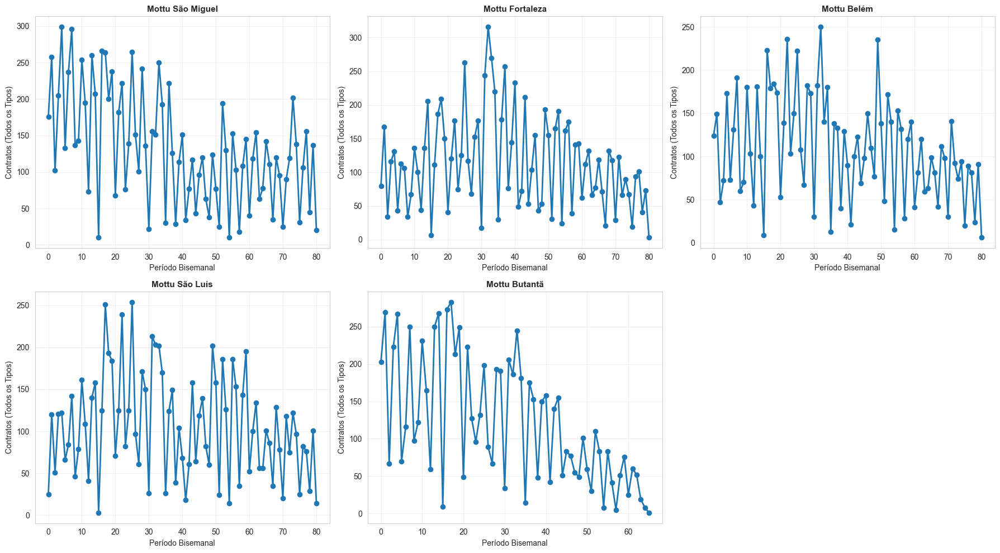
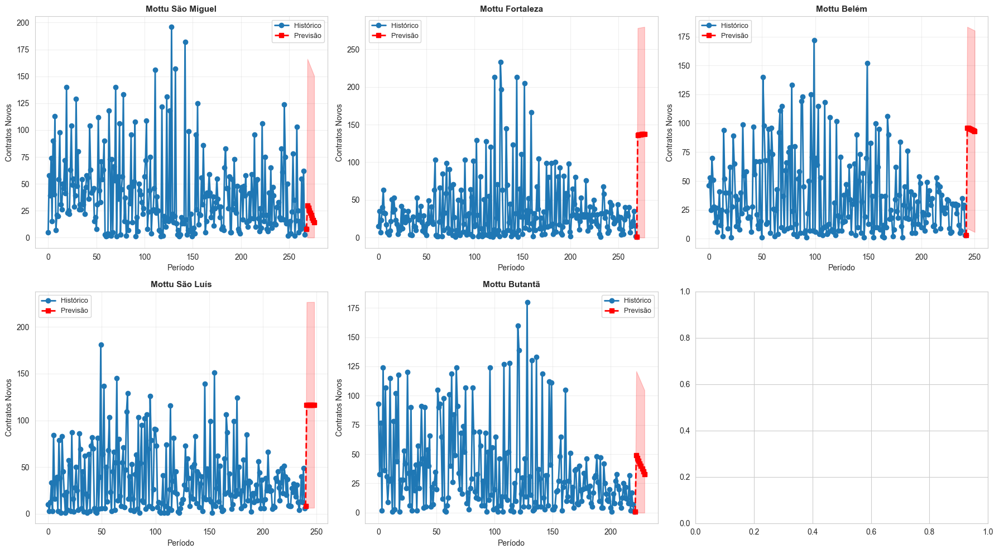

# mottu-previsao-contratos

## ⚙️ Como rodar o projeto

### Pré-requisitos
- Python 3.13+
- Conta Google Cloud com acesso ao projeto `dm-mottu-aluguel`
- [`gcloud CLI`](https://cloud.google.com/sdk/docs/install) instalado

### 1. Clone o repositório
```bash
git clone https://github.com/pedrolucas-campos/mottu-previsao-demanda.git
cd mottu-previsao-demanda
```

### 2. Crie e ative o ambiente virtual
```bash
python -m venv .venv
source .venv/bin/activate  # Linux/Mac
.venv\Scripts\activate     # Windows
```

### 3. Instale as dependências
```bash
pip install -r requirements.txt
```

### 4. Autentique no Google Cloud
```bash
gcloud auth application-default login
```

### 5. Gere seus .csv e abra os notebooks

**Para o notebook `01_previsao_contratos.ipynb` (NOVO - Previsão Bisemanal de Contratos):**
```bash
python3 contratos_bisemanal.py
# abra o notebook com o kernel python .venv
```
Este notebook realiza previsão de contratos novos (0km) para 8 semanas no futuro (período bisemanal), 
utilizando regressão linear com intervalos de confiança estatísticos. Inclui análise exploratória, 
validação do modelo (RMSE/MAE) e visualizações de tendências por filial.

---

## Scripts e Notebooks

### `contratos_bisemanal.py` (NOVO)
Extrai dados de contratos novos (0km) agregados em períodos bisemanal (a cada 2 semanas) diretamente 
do BigQuery. Realiza LEFT JOIN com a tabela `exp_atendimentos.cadastro_filiais` para incluir dados 
geográficos (longitude e latitude) das filiais. Dataset de saída: `data/raw/contratos_por_lugar_produto.csv`

**Dependências:**
- `google-cloud-bigquery`: Conexão com BigQuery
- `pandas`: Manipulação de dados
- `pyarrow`: Processamento eficiente de dados

---

### `01_previsao_contratos.ipynb`
Notebook completo de previsão de contratos para 8 semanas no futuro, com as seguintes seções:

1. **Load and Explore Data**: Carrega CSV, analisa estrutura, tipos de dados, valores faltantes
2. **Data Preprocessing and Cleaning**: Filtra contratos "Nova", faz parsing do período bisemanal, valida filiais
3. **Aggregate Contracts by Location and Time Period**: Agrupa por filial/período, identifica top 5 filiais com dados suficientes (≥5 períodos)
4. **Time Series Analysis and Visualization**: Cria gráficos de tendências históricas das top 5 filiais
5. **Train Forecasting Models**: Treina modelo LinearRegression com split 80/20, calcula RMSE e MAE
6. **Generate 8-Week Forecast**: Prevê próximos 8 períodos bisemanal com intervalos de confiança (±1.96σ)
7. **Export Forecast Results**: Exporta resultados para CSV com colunas [lugar, periodo_bisemanal, predicted_contratos_novos, lower_bound, upper_bound], cria visualizações comparativas

**Arquivos de saída:**
- `data/processed/forecast_8semanas.csv`: Previsões com intervalos de confiança
- `data/processed/01_ts_analysis.png`: Gráfico de tendências históricas
- `data/processed/02_forecast_comparison.png`: Comparação histórico vs previsão

---

## 📦 Dependências do Projeto

O arquivo `requirements.txt` contém todas as dependências necessárias:

```
pandas≥1.3.0          # Manipulação de dados tabulares
numpy≥1.20.0          # Computação numérica
matplotlib≥3.4.0      # Criação de gráficos estáticos
seaborn≥0.11.0        # Exemplos de plots com estilo
scikit-learn≥1.0.0    # Modelos de machine learning (LinearRegression)
statsmodels≥0.13.0    # Análise estatística avançada
plotly≥5.0.0          # Gráficos interativos
jupyter≥1.0.0         # Ambiente de notebooks
ipykernel≥6.0.0       # Kernel Python para Jupyter
google-cloud-bigquery≥3.0.0  # Cliente BigQuery
```

Para instalar:
```bash
pip install -r requirements.txt
```

---

## 📊 Visualizações

### TS Analysis


### Forecast Comparison

