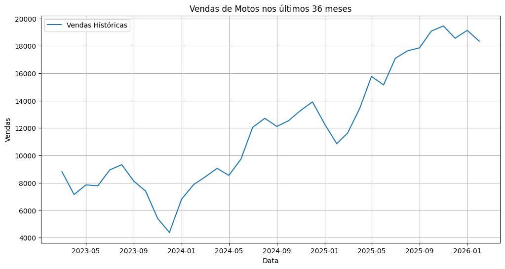
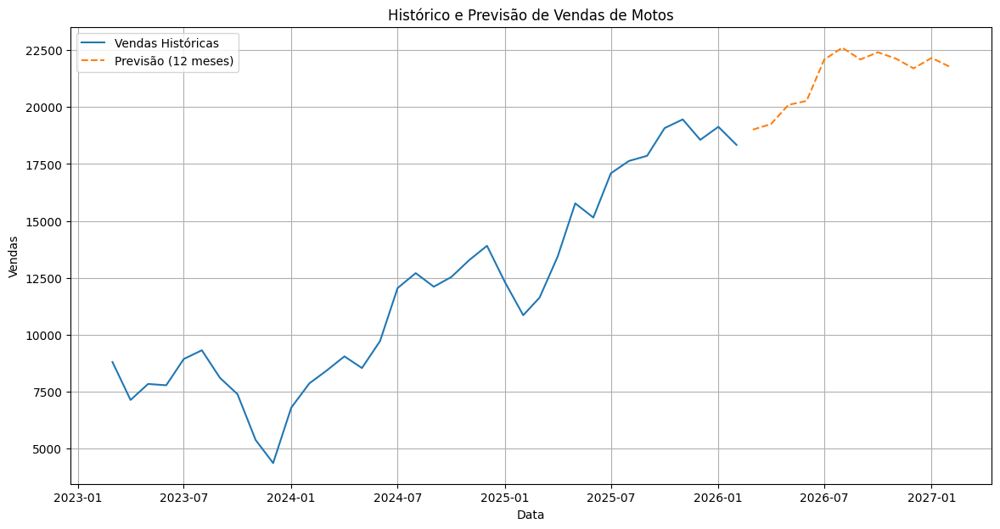
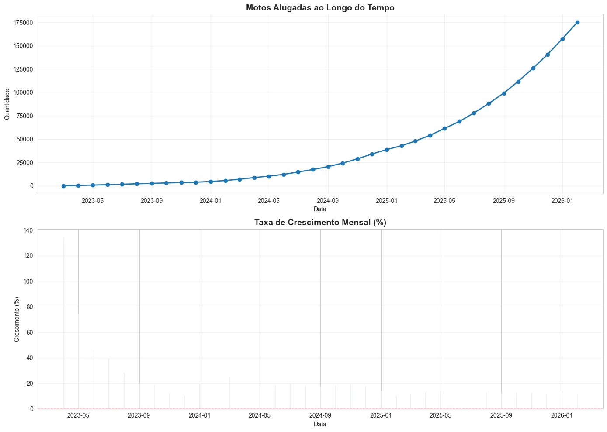
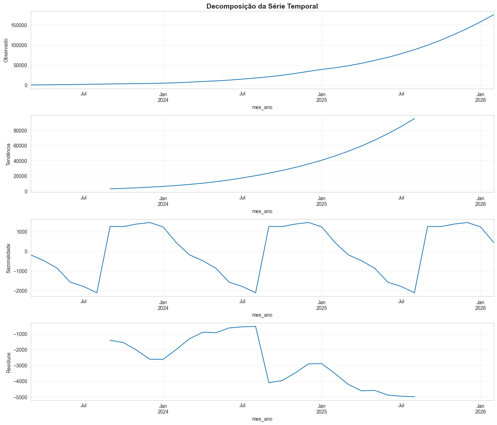
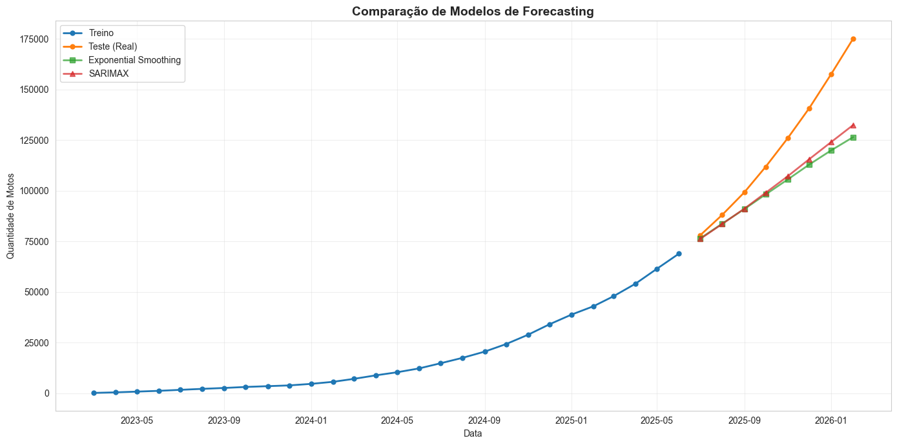
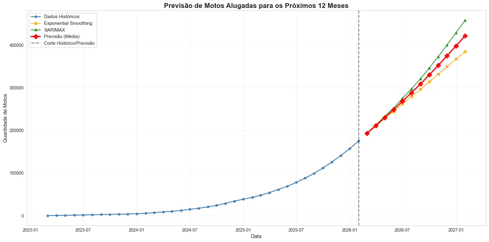

# mottu-previsao-contratos

## ⚙️ Como rodar o projeto

### Pré-requisitos
- Python 3.13+
- Conta Google Cloud com acesso ao projeto `dm-mottu-aluguel`
- [`gcloud CLI`](https://cloud.google.com/sdk/docs/install) instalado

### 1. Clone o repositório
```bash
git clone https://github.com/pedrolucas-campos/mottu-previsao-demanda.git
cd mottu-previsao-demanda
```

### 2. Crie e ative o ambiente virtual
```bash
python -m venv .venv
source .venv/bin/activate  # Linux/Mac
.venv\Scripts\activate     # Windows
```

### 3. Instale as dependências
```bash
pip install -r requirements.txt
```

### 4. Autentique no Google Cloud
```bash
gcloud auth application-default login
```

### 5. Gere seus .csv e abra os notebooks

**Para o notebook `01_previsao_contratos.ipynb` (Previsão Bisemanal de Contratos):**
```bash
python3 01_contrato_bisemanal.py
# abra o notebook com o kernel python .venv
```
Este notebook realiza previsão de contratos novos (0km) para 8 semanas no futuro (período bisemanal), 
utilizando regressão linear com intervalos de confiança estatísticos. Inclui análise exploratória, 
validação do modelo (RMSE/MAE) e visualizações de tendências por filial.

**Para o notebook `02_forecasting_contratos.ipynb` (Previsão de Vendas):**
```bash
python3 02_contrato_3anos.py
# abra o notebook com o kernel python .venv
```

**Para o notebook `03_forecasting_motos_alugadas.ipynb` (Previsão de Motos Alugadas):**
```bash
python3 03_motos_alugadas_ultimos36meses.py
# abra o notebook com o kernel python .venv
```

---

## Scripts e Notebooks

### `01_contrato_bisemanal.py` (NOVO)
Extrai dados de contratos novos (0km) agregados em períodos bisemanal (a cada 2 semanas) diretamente 
do BigQuery. Realiza LEFT JOIN com a tabela `exp_atendimentos.cadastro_filiais` para incluir dados 
geográficos (longitude e latitude) das filiais. Dataset de saída: `data/raw/01_contratos_bisemanal.csv`

**Dependências:**
- `google-cloud-bigquery`: Conexão com BigQuery
- `pandas`: Manipulação de dados
- `pyarrow`: Processamento eficiente de dados

---

### `01_previsao_contratos.ipynb`
Notebook completo de previsão de contratos para 8 semanas no futuro, com as seguintes seções:

1. **Load and Explore Data**: Carrega CSV, analisa estrutura, tipos de dados, valores faltantes
2. **Data Preprocessing and Cleaning**: Filtra contratos "Nova", faz parsing do período bisemanal, valida filiais
3. **Aggregate Contracts by Location and Time Period**: Agrupa por filial/período, identifica top 5 filiais com dados suficientes (≥5 períodos)
4. **Time Series Analysis and Visualization**: Cria gráficos de tendências históricas das top 5 filiais
5. **Train Forecasting Models**: Treina modelo LinearRegression com split 80/20, calcula RMSE e MAE
6. **Generate 8-Week Forecast**: Prevê próximos 8 períodos bisemanal com intervalos de confiança (±1.96σ)
7. **Export Forecast Results**: Exporta resultados para CSV com colunas [lugar, periodo_bisemanal, predicted_contratos_novos, lower_bound, upper_bound], cria visualizações comparativas

**Arquivos de saída:**
- `data/processed/forecast_8semanas.csv`: Previsões com intervalos de confiança
- `data/processed/01_ts_analysis.png`: Gráfico de tendências históricas
- `data/processed/02_forecast_comparison.png`: Comparação histórico vs previsão

---

### `02_contrato_3anos.py`
Extrai dados de vendas (contratos) dos últimos 36 meses do BigQuery. Dataset de saída: `data/raw/02_vendas_3anos.csv`

---

### `02_forecasting_contratos.ipynb`
Notebook de previsão de vendas para 12 meses utilizando Exponential Smoothing.

**Arquivos de saída:**
- `data/processed/02_historical_sales.png`: Gráfico de vendas históricas
- `data/processed/02_forecast_sales.png`: Gráfico de previsão de vendas

---

### `03_motos_alugadas_ultimos36meses.py`
Extrai dados de motos alugadas (saldo acumulado) dos últimos 36 meses do BigQuery. Dataset de saída: `data/raw/03_motos_alugadas.csv`

---

### `03_forecasting_motos_alugadas.ipynb`
Notebook completo de forecasting para motos alugadas nos próximos 12 meses, utilizando Exponential Smoothing e SARIMAX.

**Arquivos de saída:**
- `data/processed/forecast_motos_12meses.csv`: Previsões de motos alugadas

---

## 📦 Dependências do Projeto

O arquivo `requirements.txt` contém todas as dependências necessárias:

Para instalar:
```bash
pip install -r requirements.txt
```

---

## 📊 Visualizações

### Notebook 01 - Previsão Bisemanal de Contratos

**Time Series Analysis** - Tendências históricas das top 5 filiais por período bisemanal:


**Forecast Comparison** - Comparação entre histórico e previsão de 8 períodos bisemanal com intervalos de confiança:


### Notebook 02 - Previsão de Vendas com Exponential Smoothing

**Historical Sales** - Vendas históricas dos últimos 36 meses:


**Forecast Sales** - Previsão de vendas para os próximos 12 meses:


### Notebook 03 - Previsão de Motos Alugadas

**Histórico de Motos Alugadas** - Gráfico de dados históricos e taxa de crescimento mensal:


**Decomposição da Série Temporal** - Análise de tendência, sazonalidade e resíduos:


**Comparação de Modelos** - Comparação de desempenho entre Exponential Smoothing e SARIMAX:


**Previsão para os Próximos 12 Meses** - Previsão final de motos alugadas com intervalo de confiança:

